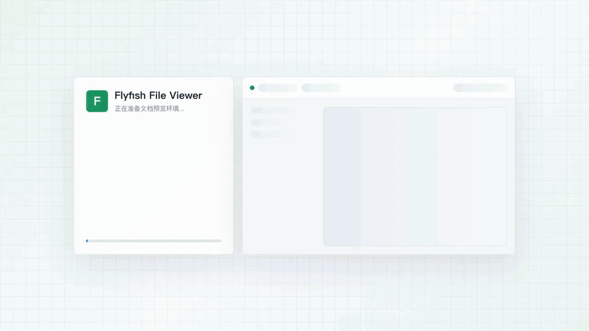

<p align="center">
  <a href="https://file-viewer.app">
    
  </a>
</p>

<h1 align="center">File Viewer</h1>

<p align="center">
  <strong>Component xem trước tệp thuần front-end cho hệ thống quản trị doanh nghiệp, mạng nội bộ và hệ thống triển khai riêng.</strong>
</p>

<p align="center">
  Không cần chuyển mã phía máy chủ, xem trước ngay trong trình duyệt các tệp đính kèm nghiệp vụ thường gặp như Office, PDF/OFD, CAD, tệp nén, email, hình ảnh, âm thanh/video, mã nguồn... Hỗ trợ Vue, React, Svelte, jQuery và Web Components.
</p>

<p align="center">
  <a href="https://demo.file-viewer.app">Demo trực tuyến</a> ·
  <a href="https://doc.file-viewer.app">Tài liệu</a> ·
  <a href="https://github.com/flyfish-dev/file-viewer/wiki">GitHub Wiki</a> ·
  <a href="#bắt-đầu-nhanh">Bắt đầu nhanh</a> ·
  <a href="#định-dạng-hỗ-trợ">Định dạng hỗ trợ</a>
</p>

<p align="center">
  <a href="README.md">Tiếng Việt</a> · <a href="README.en.md">English</a> · <a href="README.zh.md">简体中文</a>
</p>

<p align="center">
  <a href="https://www.npmjs.com/package/@file-viewer/core"></a>
  <a href="https://www.npmjs.com/package/@file-viewer/vue3"></a>
  <a href="https://github.com/flyfish-dev/file-viewer"></a>
  <a href="https://github.com/flyfish-dev/file-viewer/releases"></a>
  <a href="https://doc.file-viewer.app"></a>
  <a href="https://github.com/flyfish-dev/file-viewer/wiki"></a>
  <a href="https://demo.file-viewer.app"></a>
  <a href="https://linux.do"></a>
  <a href="https://github.com/flyfish-dev/file-viewer/blob/main/LICENSE"></a>
  <a href="https://hub.docker.com/r/flyfishdev/file-viewer"></a>
  
  
  
</p>

---

## Định vị dự án

File Viewer là component xem trước tệp thuần trình duyệt hướng đến các hệ thống nghiệp vụ. Kịch bản cốt lõi là xem trước tệp đính kèm trong hệ thống quản trị doanh nghiệp, OA, cơ sở tri thức, hệ thống ticket, trung tâm đính kèm, kho tài liệu kỹ thuật và các dự án bàn giao triển khai riêng.

Không cần dịch vụ chuyển mã phía backend, cũng không yêu cầu đưa tệp riêng tư lên đám mây để chuyển đổi. Một component, một bộ API, bao phủ Office, PDF, OFD, Typst, CAD, XMind, tệp nén, email, bản vẽ, âm thanh/video, mã nguồn, PSD, phông chữ và dữ liệu có cấu trúc. Hiện tích hợp sẵn 206 ánh xạ phần mở rộng và 24 luồng xem trước.

Dự án mới nên ưu tiên dùng `@file-viewer/*`; các gói lịch sử `@flyfish-group/*` vẫn tiếp tục được bảo trì đồng bộ.

## Điểm nổi bật

- **Tích hợp nhanh.** Vanilla JS, Vue, React, Svelte, jQuery đều có component gốc; gói full lấy được toàn bộ khả năng chỉ trong một bước.
- **Phủ rộng.** 206 phần mở rộng, 24 luồng xem trước, bao phủ tệp đính kèm văn phòng, kỹ thuật, thiết kế, dữ liệu và mã nguồn thường gặp.
- **Thuần front-end.** Phân tích và kết xuất ngay trong trình duyệt, hỗ trợ ngoại tuyến, mạng nội bộ, Docker, CDN riêng và tự host tài nguyên nghiêm ngặt.
- **Mô-đun hóa.** Component nhẹ, renderer, preset, gói full phân lớp rõ ràng, vừa cài tối giản được vừa lấy toàn bộ một bước được.
- **Tải theo yêu cầu.** Các khả năng nặng như PDF, Office, CAD, Typst, tệp nén, bản vẽ, PSD, Mermaid chỉ tải khi trúng định dạng.
- **Thao tác đầy đủ.** Tìm kiếm, tô sáng, thu phóng, in, xuất HTML, tải xuống, watermark, chủ đề, hook vòng đời và kiểm tra tiền điều kiện nút bấm đều đi qua cùng một API.
- **Hệ sinh thái nhất quán.** Core tập trung vào khả năng nền tảng, mỗi component framework chỉ đóng gói gốc, giữ trải nghiệm tham số, sự kiện và controller nhất quán.

## Chọn điểm khởi đầu theo kịch bản

| Người dùng | Họ quan tâm điều gì | Điểm khởi đầu đề xuất |
| --- | --- | --- |
| Quản trị doanh nghiệp / OA | Xem trước đính kèm Word, Excel, PPT, PDF | [Bắt đầu nhanh](#bắt-đầu-nhanh) / [Office preset](https://doc.file-viewer.app/guide/quickstart) |
| Hệ thống tài liệu kỹ thuật | Sơ duyệt bản vẽ DWG, DXF, DWF | [Định dạng hỗ trợ](#định-dạng-hỗ-trợ) / [Độ hoàn thiện định dạng](https://doc.file-viewer.app/guide/format-fidelity) |
| Người dùng component front-end | Tích hợp Vue / React / Web Component | [Tổng quan component hệ sinh thái](https://doc.file-viewer.app/guide/ecosystem) |
| Đội bàn giao triển khai riêng | Ngoại tuyến, mạng nội bộ, tự host Worker / WASM | [Phát hành & phân phối](https://doc.file-viewer.app/guide/distribution) / [Triển khai Docker](https://doc.file-viewer.app/guide/docker) |

## Xem thử trực tuyến



Mở [demo.file-viewer.app](https://demo.file-viewer.app) để trải nghiệm trực tiếp các kịch bản hợp đồng Word, báo cáo Excel, tài liệu PPT, bản vẽ DWG, tệp nén và email; cũng có thể mở tiếp ma trận mẫu đầy đủ, tải lên tệp đã ẩn thông tin nhạy cảm của bạn, sao chép mã tích hợp React của mẫu hiện tại để kiểm chứng thanh công cụ, so sánh tài liệu và hiệu quả tải tài nguyên ngoại tuyến.

## Phản hồi về tương thích

Dự án này vẫn đang tiếp tục hoàn thiện, đặc biệt cần các tệp nghiệp vụ thực tế để kiểm chứng tính tương thích.

Nếu bạn có mẫu DOC / XLS / PPT / DWG / DWF / tệp nén / email không bảo mật, có thể ẩn thông tin nhạy cảm, hãy thử với [Demo](https://demo.file-viewer.app). Khi gặp kiểu dáng không khớp, không mở được, lỗi đường dẫn triển khai nội bộ hay bất thường trên di động, đều có thể phản hồi qua issue.

Nếu hướng đi này hữu ích với bạn, cũng rất hoan nghênh lưu lại dự án. So với chỉ Star, chúng tôi mong nhận được phản hồi tương thích trong tình huống thực tế hơn.

## Bắt đầu nhanh

Trước tiên chọn lớp tích hợp, rồi chọn khả năng định dạng theo nhu cầu. Khi chỉ muốn có trải nghiệm đầy đủ nhanh nhất, hãy dùng thẳng gói `*-full`.

| Kịch bản | Đề xuất cài đặt |
| --- | --- |
| Thẻ script / CDN đầy đủ khả năng | `@file-viewer/web-full` |
| Vanilla JS npm | `@file-viewer/web` + `@file-viewer/preset-all` |
| Vue 3 | `@file-viewer/vue3-full`, hoặc `@file-viewer/vue3` + preset |
| Vue 2.7 / 2.6 | `@file-viewer/vue2.7-full` / `@file-viewer/vue2.6-full` |
| React 18/19 | `@file-viewer/react-full` |
| React 16.8/17 | `@file-viewer/react-legacy-full` |
| Svelte | `@file-viewer/svelte-full` |
| jQuery | `@file-viewer/jquery-full` |
| Cắt gọt chính xác | Bất kỳ gói component nào + `@file-viewer/preset-*` hoặc renderer độc lập |

### CDN / Thẻ script

```html
<script src="https://cdn.jsdelivr.net/npm/@file-viewer/web-full@latest/dist/flyfish-file-viewer-web-full.iife.js"></script>

<flyfish-file-viewer
  src="/files/report.pdf"
  theme="light"
  toolbar-position="bottom-right"
  style="display:block;height:720px"
></flyfish-file-viewer>
```

Gói IIFE CDN đầu tiên của `web-full` chỉ đăng ký Custom Element, controller và lazy full preset; các renderer nặng như PDF, Word, Excel, CAD, Typst, tệp nén... sẽ được tải bất đồng bộ từ `dist/renderers/*.iife.js` khi trúng loại tệp. Worker, WASM, phông chữ và tài nguyên vendor tiếp tục được phân giải tự động theo URL script; khi triển khai nội bộ chỉ cần sao chép toàn bộ thư mục `dist` sang miền tĩnh của bạn.

### Vanilla JS

```bash
npm i @file-viewer/web @file-viewer/preset-all
```

```ts
import { mountViewer } from '@file-viewer/web'
import presetAll from '@file-viewer/preset-all'

mountViewer(document.querySelector('#viewer')!, {
  url: '/files/report.docx',
  options: { preset: presetAll, theme: 'light' }
})
```

### Vue 3

```bash
npm i @file-viewer/vue3-full
```

```ts
import { createApp } from 'vue'
import FileViewer from '@file-viewer/vue3-full'

createApp(App).use(FileViewer).mount('#app')
```

```vue
<file-viewer url="/files/report.docx" />
```

### Vue 2

```bash
npm i @file-viewer/vue2.7-full
# Dự án Vue 2.6 dùng @file-viewer/vue2.6-full
```

```ts
import Vue from 'vue'
import FileViewer from '@file-viewer/vue2.7-full'

Vue.use(FileViewer)
```

### React

```bash
npm i @file-viewer/react-full
```

```tsx
import FileViewer from '@file-viewer/react-full'

export function Preview() {
  return <FileViewer url="/files/report.pdf" style={{ height: 720 }} />
}
```

### Svelte

```bash
npm i @file-viewer/svelte-full
```

```svelte
<script>
  import FileViewer from '@file-viewer/svelte-full'
</script>

<FileViewer url="/files/report.pdf" containerStyle="height:720px" />
```

### jQuery

```bash
npm i @file-viewer/jquery-full
```

```ts
import '@file-viewer/jquery-full'

$('#viewer').fileViewer({ url: '/files/report.pdf' })
```

### Kết hợp theo yêu cầu

```bash
npm i @file-viewer/vue3 @file-viewer/preset-office
```

```ts
import officePreset from '@file-viewer/preset-office'

const options = {
  preset: officePreset,
  theme: 'light',
  toolbar: { position: 'bottom-right' }
}
```

Dự án Vite có thể cài thêm `@file-viewer/vite-plugin` để tự phát hiện preset đã cài và sao chép tài nguyên Worker/WASM/phông chữ/vendor; dự án không dùng Vite thì dùng thẳng `options.preset`, không cần plugin bổ sung.

## Kiến trúc

- `@file-viewer/core`: nhận diện định dạng, tải tài nguyên, giao thức renderer, vòng đời, tìm kiếm, thu phóng, in, xuất và API controller.
- `@file-viewer/renderer-*`: các khả năng kết xuất độc lập như PDF, Word, PPTX, CAD, Typst, Archive, Drawing, Data, EDA.
- `@file-viewer/preset-*`: bốn nhóm khả năng `lite`, `office`, `engineering`, `all`.
- `@file-viewer/web|vue3|vue2.7|vue2.6|react|react-legacy|svelte|jquery`: component gốc của từng hệ sinh thái.
- `@file-viewer/*-full`: gói một bước gồm component + `preset-all`, phù hợp kiểm chứng nhanh và trung tâm đính kèm toàn định dạng.

## Các điểm truy cập

| Điểm truy cập | Địa chỉ |
| --- | --- |
| Website chính thức | [file-viewer.app](https://file-viewer.app) |
| Tài liệu chính thức | [doc.file-viewer.app](https://doc.file-viewer.app) |
| Demo trực tuyến | [demo.file-viewer.app](https://demo.file-viewer.app) |
| Demo so sánh tài liệu | [demo.file-viewer.app/compare.html](https://demo.file-viewer.app/compare.html) |
| Tải bản Release | [github.com/flyfish-dev/file-viewer/releases](https://github.com/flyfish-dev/file-viewer/releases) |
| Docker image | `flyfishdev/file-viewer:latest` |
| Liên kết Linux Do | [linux.do](https://linux.do) |
| Ủng hộ & hỗ trợ ưu tiên | [dev.flyfish.group/sponsor?source=github](https://dev.flyfish.group/sponsor?source=github) |

## Định dạng hỗ trợ

Phiên bản hiện tại tích hợp sẵn 206 ánh xạ phần mở rộng, bao phủ 24 luồng xem trước.

| Loại | Phần mở rộng | Hiện trạng | Kịch bản phù hợp |
| -------------- | ------------------------------------------------------------------------------------------------------------------------------------------------------------------------------------------------------------------------------------------------------------------------------------------------------------------------------ | ------------------------------------------------------------------------------------------------------------------------------------------------------------------------------------------------------------------- | ------------------------------------------- |
| Word | `docx`, `docm`, `dotx`, `dotm` | `@file-viewer/renderer-word` + `@file-viewer/docx` tự phát triển, phân tích bằng Worker, đọc liên tục theo luồng, cache trường mục lục và kết xuất theo lô bất đồng bộ; định dạng template/macro xử lý dạng xem trước chỉ đọc | Tài liệu Word mới tạo, tài liệu chính thức, template Word |
| Word | `doc`, `dot` | `@file-viewer/renderer-word` + `msdoc-viewer`, dùng khung trang kiểu Word, tăng khả năng chịu lỗi CFB và bố cục bảng | Tài liệu `.doc` cũ, template Word 97-2003 |
| Tài liệu tương thích | `rtf`, `odt` | `@file-viewer/renderer-word` + xem trước tương thích `rtf.js` / `content.xml` của ODF | Văn bản giàu RTF, tài liệu văn bản OpenDocument |
| Excel | `xlsx`, `xltx` | `@file-viewer/renderer-spreadsheet` + `styled-exceljs` + cuộn ảo, hỗ trợ kích thước, gộp ô, kiểu dáng thường gặp, màu chữ tự động, ảnh workbook drawing và kéo tùy chọn để chỉnh độ rộng cột theo tiêu đề; mặc định `worker: auto`, tệp lớn tự bật Worker, tệp nhỏ giữ đường tương thích trên luồng chính; nút in ẩn theo khả năng, tránh chỉ in vùng nhìn hiện tại | Nghiệp vụ cần giữ cấu trúc và kiểu dáng bảng, template Excel |
| Định dạng Excel tương thích | `xlsm`, `xlsb`, `xls`, `xlt`, `xltm`, `csv`, `ods`, `fods`, `numbers` | Phân tích thống nhất, khôi phục kiểu dáng dần theo thông tin khả dụng của từng định dạng; cũng tuân theo ranh giới in của bảng ảo | Bảng cũ, xem dữ liệu nhẹ |
| PowerPoint | `pptx`, `pptm`, `potx`, `potm`, `ppsx`, `ppsm`, `odp` | Duyệt nội dung slide bằng engine gốc mã nguồn mở độc lập `@file-viewer/pptx`, Worker phân tích dần và xuất theo trang; ODP đi qua xem trước văn bản slide OpenDocument | Tài liệu báo cáo, giáo án, phương án, template trình chiếu |
| PDF | `pdf` | Xem trước dựa trên `pdfjs-dist`, URL cùng nguồn mặc định đọc dần; khi máy chủ hỗ trợ Range sẽ tự tải theo phân đoạn, hỗ trợ thanh công cụ thu phóng, xoay trang, chuyển sidebar trang/mục lục, tự vừa chiều rộng, in đầy đủ và xuất HTML | Hợp đồng, hóa đơn, thành phẩm bố cục |
| OFD | `ofd` | Xem trước trực tuyến tài liệu bố cục nội địa dựa trên mã nguồn kho `DLTech21/ofd.js`, tránh nhánh wasm bản quyền của npm dist | Hóa đơn điện tử, công văn, tài liệu lưu trữ |
| Typst | `typ`, `typst` | Đọc trực tiếp tệp nguồn Typst, tải theo yêu cầu trình biên dịch WASM trình duyệt `@myriaddreamin/typst.ts`, bộ kết xuất SVG và tài nguyên phông chữ cục bộ; hỗ trợ xem trước đầy đủ, in và xuất HTML | Báo cáo kỹ thuật, bản thảo luận văn, template tài liệu kỹ thuật |
| Tệp nén | `zip`, `zipx`, `7z`, `rar`, `tar`, `gz`, `gzip`, `tgz`, `bz2`, `bzip2`, `tbz`, `tbz2`, `xz`, `txz`, `lzma`, `zst`, `tzst`, `cab`, `ar`, `cpio`, `iso`, `xar`, `lha`, `lzh`, `jar`, `war`, `ear`, `apk`, `cbz`, `cbr` | `@file-viewer/renderer-archive` dựa trên `libarchive.js` WASM Worker đọc danh mục, sau khi nhấp sẽ giải nén tệp bên trong theo yêu cầu và dùng lại trình xem thống nhất, hỗ trợ cache IndexedDB, fallback ZIP/TAR/GZIP và giới hạn dung lượng | Đính kèm lưu trữ, gói bàn giao hàng loạt, xem nhanh tài liệu trong tệp nén |
| Email | `eml`, `msg`, `mbox` | `@file-viewer/renderer-email` xử lý riêng luồng email; EML/MBOX dùng `postal-mime`, MSG dùng `@kenjiuno/msgreader`, hỗ trợ thông tin header, nội dung HTML/văn bản, tải và xem trước tệp đính kèm | Lưu trữ email, email ticket, đính kèm thư khách hàng |
| EDA | `olb`, `dra`, `gds`, `oas`, `oasis` | `@file-viewer/renderer-eda` xử lý riêng; dùng `cfb` phân tích container CFB thường gặp của OrCAD/Allegro; GDSII chuẩn sẽ đọc structure, boundary, path, text, reference, ảnh nhỏ xuất SVG, tập phần tử lớn tự chuyển sang WebGL canvas; OAS/OASIS dạng fixture văn bản đọc được xuất xem trước SVG, OASIS nhị phân SEMI thật trước tiên lập chỉ mục cấu trúc an toàn, chuỗi đọc được, ứng viên thực thể và chẩn đoán, không phóng đại kiểm định điện/hình học chuyên môn | Thư viện linh kiện, bản vẽ đóng gói, sơ duyệt đính kèm layout chip |
| CAD | `dwg`, `dxf`, `dwf`, `dwfx`, `xps` | Xem trước bản vẽ dựa trên `@flyfish-dev/cad-viewer`; DWG phân tích qua Worker + LibreDWG WASM, DXF dùng JS parser, DWF/DWFx/XPS dùng `dwf-viewer` gốc kết xuất đồ họa W2D/W3D/XPS | Bản vẽ kỹ thuật, đính kèm CAD 2D, tệp lưu trữ AutoCAD |
| Mô hình 3D | `glb`, `gltf`, `obj`, `stl`, `ply`, `fbx`, `dae`, `3ds`, `3mf`, `amf`, `usd`, `usda`, `usdc`, `usdz`, `kmz`, `pcd`, `wrl`, `vrml`, `xyz`, `vtk`, `vtp`, `step`, `stp`, `iges`, `igs`, `ifc`, `3dm` | `@file-viewer/renderer-3d` dựa trên Three.js loaders để xem trước tương tác; định dạng CAD/BIM kỹ thuật sẽ nêu lý do không tích hợp nhân hình học và gợi ý chuyển đổi | Mô hình thiết kế, đám mây điểm, tài sản 3D, mô hình kỹ thuật |
| Dữ liệu địa lý | `geojson`, `kml`, `gpx`, `shp` | `@file-viewer/renderer-geo` xử lý riêng; `@tmcw/togeojson` / `shpjs` chuyển sang GeoJSON, hỗ trợ chuẩn hóa CRS, dùng bản đồ vector MapLibre ngoại tuyến chồng điểm/đường/vùng, thất bại thì lùi về xem trước SVG | Đính kèm địa lý, đường đi, ranh giới và dữ liệu GIS nhẹ |
| XMind (sơ đồ tư duy) | `xmind` | Dựa trên `@ljheee/xmind-parser` phân tích XML của XMind 8 và cấu trúc gói JSON của XMind 2020+, kết xuất ngoại tuyến sơ đồ tư duy nhiều sheet, nút, nhãn, ghi chú, liên kết, đánh dấu, ảnh và cây mục lục, dùng `@panzoom/panzoom` cung cấp kéo/rê, chụm hai ngón trên di động, thu phóng theo con lăn, di chuyển bằng bàn phím, đồng bộ trạng thái toolbar thống nhất, vừa canvas, tìm kiếm, in, xuất HTML và thu phóng | Sơ đồ tư duy, kế hoạch dự án, cấu trúc tri thức, biên bản họp |
| Excalidraw | `excalidraw` | `@file-viewer/renderer-drawing` mặc định dùng `roughjs` xuất SVG chỉ đọc ổn định; khi môi trường có sẵn module ESM `@excalidraw/excalidraw` chính thức sẽ ưu tiên thử `restore` + `exportToSvg` và tự động lùi lại | Bản phác thảo whiteboard, nháp quy trình, hình trao đổi sản phẩm |
| draw.io | `drawio`, `dio` | Xem trước mxGraphModel / mxfile dựa trên `GraphViewer` chính thức của diagrams.net | Sơ đồ quy trình, sơ đồ kiến trúc, sơ đồ nghiệp vụ dạng làn bơi |
| Mermaid | `mermaid`, `mmd` | `@file-viewer/renderer-drawing` tải theo yêu cầu `mermaid` chính thức, xuất SVG thích ứng chủ đề, và qua `@panzoom/panzoom` hỗ trợ kéo, thu phóng, reset và liên động thanh công cụ thống nhất | Sơ đồ kiến trúc, quy trình, trạng thái, tuần tự |
| PlantUML | `plantuml`, `puml` | Dùng `plantuml-encoder` tạo payload kết xuất, hỗ trợ cấu hình dịch vụ PlantUML SVG tự host; lớp xem trước cũng hỗ trợ kéo, thu phóng và thích ứng khung chủ đề | Sơ đồ tuần tự, thành phần, triển khai UML |
| Sách điện tử | `epub` | `@file-viewer/renderer-epub` dựa trên `epubjs` phân tích mục lục và tài nguyên chương, dùng đọc cuộn tương thích tốt hơn | Sách điện tử, sổ tay đào tạo, tài liệu đọc dài |
| Sách điện tử | `umd` | Phân tích metadata, mục lục và nội dung nén zlib theo cấu trúc sách điện tử di động UMD | Sách điện tử di động cũ, đính kèm tiểu thuyết cũ |
| Markdown | `md`, `markdown` | `@file-viewer/renderer-text` cung cấp kiểu đọc Markdown, hỗ trợ mặt đọc chủ đề sáng/tối | README, tài liệu tri thức, tài liệu hướng dẫn |
| Hình ảnh | `gif`, `jpg`, `jpeg`, `bmp`, `tiff`, `tif`, `png`, `svg`, `webp`, `avif`, `ico`, `heic`, `heif`, `jxl` | Xem ảnh gốc; khi trúng HEIC/HEIF dùng `heic2any` chuyển đổi theo yêu cầu | Đính kèm ảnh, bản thiết kế, Logo, ảnh di động |
| Mã/Văn bản | `txt`, `json`, `jsonc`, `json5`, `ipynb`, `yaml`, `yml`, `toml`, `ini`, `proto`, `hcl`, `tex`, `gv`, `http`, `js`, `mjs`, `cjs`, `jsx`, `ts`, `tsx`, `vue`, `react`, `css`, `html`, `htm`, `xml`, `log`, `java`, `py`, `go`, `rs`, `rb`, `swift`, `kt`, `php`, `c`, `cpp`, `cc`, `h`, `hpp`, `cs`, `sh`, `bash`, `sql`, `diff`, `patch`, `bundle`, `bdl` | `@file-viewer/renderer-text` dùng `highlight.js` tô sáng nhẹ; patch tải theo yêu cầu `diff2html` để so sánh trái/phải, git bundle phân tích refs, lịch sử, cây tệp và nội dung blob đọc được | Log, cấu hình, đoạn mã, phản hồi API, review code |
| Âm thanh | `mp3`, `mpeg`, `wav`, `ogg`, `oga`, `opus`, `m4a`, `aac`, `flac`, `weba`, `midi`, `mid` | `@file-viewer/renderer-media` dùng phát âm thanh gốc của trình duyệt; khi trúng MIDI tải theo yêu cầu `@tonejs/midi` hiển thị cấu trúc track | Ghi âm, podcast, đính kèm giọng nói, tư liệu hiệu ứng âm thanh, tệp MIDI |
| Video | `mp4`, `webm`, `m3u8` | `@file-viewer/renderer-media` dùng phát video gốc của trình duyệt; danh sách HLS khi cần tải theo yêu cầu `hls.js` | Video trình bày, quay màn hình, luồng HLS |
| Phông chữ/Thiết kế/Dữ liệu | `ttf`, `otf`, `woff`, `woff2`, `psd`, `ai`, `eps`, `sqlite`, `wasm`, `parquet`, `avro`, `webarchive` | `@file-viewer/renderer-data` xử lý riêng, dựa trên FontFace, `ag-psd`, `sql.js`, `hyparquet`, `avsc`, WebAssembly Module và tóm tắt an toàn; PSD hỗ trợ chọn hiện/ẩn lớp, vẽ lại và thu phóng thống nhất; SQLite WASM hỗ trợ cấu hình triển khai riêng | Phông chữ, tài sản thiết kế, cơ sở dữ liệu, dữ liệu dạng cột và Web archive |

## Kết hợp khả năng

Gói component mặc định giữ nhẹ, khả năng định dạng được trang bị qua preset hoặc renderer.

| Chế độ | Kịch bản phù hợp | Ví dụ |
| --- | --- | --- |
| `*-full` | Muốn có khả năng đầy đủ nhanh nhất | `@file-viewer/vue3-full` |
| Component + preset | Đa số hệ thống nghiệp vụ, cân bằng dung lượng và khả năng | `@file-viewer/vue3` + `@file-viewer/preset-office` |
| Component + nhiều preset | Kết hợp đính kèm văn phòng và kỹ thuật | `preset: [officePreset, engineeringPreset]` |
| Component + renderer | Chỉ cần một hoặc vài định dạng | `@file-viewer/renderer-pdf` |
| CDN full | Không công cụ build, thẻ script, kiểm chứng nhanh | `@file-viewer/web-full` |
| Plugin Vite | Dự án Vite tự phát hiện preset đã cài và sao chép tài nguyên | `@file-viewer/vite-plugin` |

Chọn preset:

| preset | Phạm vi bao phủ |
| --- | --- |
| `@file-viewer/preset-lite` | Văn bản, Markdown, mã nguồn, hình ảnh, âm thanh, video |
| `@file-viewer/preset-office` | PDF, Word, Excel, PowerPoint, OFD, RTF, OpenDocument |
| `@file-viewer/preset-engineering` | CAD, 3D, bản vẽ, XMind, Geo, Typst, Archive, Data, EDA |
| `@file-viewer/preset-all` | Toàn bộ ma trận định dạng của Demo chính thức |

Quốc tế hóa, chủ đề, watermark, thanh công cụ, tìm kiếm, in, xuất, vòng đời và kiểm tra quyền tiền điều kiện đều cấu hình qua cùng một bộ `options`. Xem API đầy đủ tại [tài liệu chính thức](https://doc.file-viewer.app/guide/usage).

## Hệ sinh thái npm hiện tại

Phiên bản hiện tại lấy dist-tag `latest` của npm registry làm chuẩn, bảo trì tổng cộng 50 mục tiêu phát hành npm: 45 gói component tiêu chuẩn/full/core/renderer/preset/plugin kỹ thuật + 5 alias tương thích lịch sử. Dự án mới nên ưu tiên dùng tên gói tiêu chuẩn `@file-viewer/*`; dự án cũ tiếp tục dùng `@flyfish-group/*` hoặc `file-viewer3` vẫn nhận được khả năng cùng phiên bản.

| Kịch bản | Gói npm đề xuất | Gói tương thích lịch sử | Chiến lược phiên bản | Ghi chú |
| ----------------------------------- | ------------------------------------------------------------------------------------------------------------------------------------------------------------------------------------------------------------------------------------------------------------------------------------------------------------------------------------------------------------------------------------------------------------------------------------------------------------------------------------------------------------------------------------------------------------------------------------------------------------------------------------------------------------------------------------------------------------------------------------------------------------------------------------------------------------------------------------------------------------------------------------------------------------------------------------------------------------------------------- | -------------------------------------------------------------------------------------------------------------------------------------------------------- | -------- | ----------------------------------------------------------------------------------------------------------------------------------------------------------------------- |
| Nền tảng Core | [`@file-viewer/core`](https://www.npmjs.com/package/@file-viewer/core) | Không | `latest` | Ma trận định dạng độc lập framework, khả năng xem trước, tải tài nguyên, sự kiện vòng đời, tìm kiếm, thu phóng, in, xuất và API thao tác |
| Engine PPTX gốc | [`@file-viewer/pptx`](https://www.npmjs.com/package/@file-viewer/pptx) | Không | `latest` | Engine kết xuất PPTX độc lập tách ra từ bản ổn định lịch sử của Flyfish, Worker phân tích dần, do `@file-viewer/renderer-presentation` tải theo yêu cầu |
| Renderer Word | [`@file-viewer/renderer-word`](https://www.npmjs.com/package/@file-viewer/renderer-word) | Không | `latest` | Plugin renderer tiêu chuẩn, xử lý luồng DOCX/DOC/DOT/RTF/ODT, bên trong tải theo yêu cầu `@file-viewer/docx`, `msdoc-viewer` và `rtf.js`, cài core-only không kéo phụ thuộc nặng của Word |
| Renderer trình chiếu | [`@file-viewer/renderer-presentation`](https://www.npmjs.com/package/@file-viewer/renderer-presentation) | Không | `latest` | Plugin renderer tiêu chuẩn, dựa trên `@file-viewer/pptx` cung cấp xem trước theo yêu cầu, thu phóng, in và xuất PPTX/PPTM/POTX/POTM/PPSX/PPSM |
| Renderer bản vẽ | [`@file-viewer/renderer-drawing`](https://www.npmjs.com/package/@file-viewer/renderer-drawing) | Không | `latest` | Plugin renderer tiêu chuẩn, cung cấp viewer ngoại tuyến Draw.io / diagrams.net, SVG chỉ đọc Excalidraw, kết xuất SVG Mermaid chính thức, tích hợp dịch vụ SVG PlantUML, kéo thu phóng Panzoom, in và xuất HTML |
| Renderer mô hình 3D | [`@file-viewer/renderer-3d`](https://www.npmjs.com/package/@file-viewer/renderer-3d) | Không | `latest` | Plugin renderer tiêu chuẩn, dựa trên Three.js loaders cung cấp xem trước WebGL theo yêu cầu cho GLTF/GLB, OBJ, STL, PLY, FBX, DAE, 3DS, 3MF, USD/USDZ, đám mây điểm và VTK |
| Renderer tài sản dữ liệu | [`@file-viewer/renderer-data`](https://www.npmjs.com/package/@file-viewer/renderer-data) | Không | `latest` | Plugin renderer tiêu chuẩn, dựa trên `ag-psd`, `sql.js`, `hyparquet`, `avsc`, FontFace và WebAssembly Module cung cấp xem trước PSD, SQLite, Parquet, Avro, phông chữ, WASM, AI/EPS, WebArchive |
| Renderer EDA | [`@file-viewer/renderer-eda`](https://www.npmjs.com/package/@file-viewer/renderer-eda) | Không | `latest` | Plugin renderer tiêu chuẩn, cung cấp xem trước cấu trúc OLB, DRA, GDSII, OASIS; GDSII chuẩn tạo được xem trước layout SVG/WebGL, fixture văn bản OASIS tạo được SVG, OASIS nhị phân thật giữ ranh giới chẩn đoán cấu trúc |
| Preset renderer nhẹ | [`@file-viewer/preset-lite`](https://www.npmjs.com/package/@file-viewer/preset-lite) | Không | `latest` | Trang bị một lần xem trước văn bản, Markdown, mã nguồn, hình ảnh, âm thanh và video, phù hợp kịch bản đính kèm nhẹ thường gặp |
| Preset renderer Office | [`@file-viewer/preset-office`](https://www.npmjs.com/package/@file-viewer/preset-office) | Không | `latest` | Trang bị một lần luồng tài liệu PDF, Word, Excel, PowerPoint, OFD, RTF và OpenDocument |
| Preset renderer kỹ thuật | [`@file-viewer/preset-engineering`](https://www.npmjs.com/package/@file-viewer/preset-engineering) | Không | `latest` | Trang bị một lần luồng đính kèm kỹ thuật CAD, 3D, bản vẽ, XMind, Geo, Typst, Archive, Data và EDA |
| Preset renderer toàn bộ | [`@file-viewer/preset-all`](https://www.npmjs.com/package/@file-viewer/preset-all) | Không | `latest` | Trang bị một lần Word, PDF, OFD, PPTX, CAD, Draw.io/Excalidraw/Mermaid/PlantUML, Typst, XMind, tệp nén, email, sách điện tử, mã/Markdown/Patch/Git Bundle, hình ảnh, âm thanh/video và toàn bộ khả năng định dạng còn lại của core |
| Plugin Vite trang bị theo yêu cầu | [`@file-viewer/vite-plugin`](https://www.npmjs.com/package/@file-viewer/vite-plugin) | Không | `latest` | Miễn cấu hình tự phát hiện `@file-viewer/preset-*` đã cài và kích hoạt khả năng tương ứng; cũng có thể sinh `virtual:file-viewer-renderers` theo `formats`, `renderers` hoặc hint mã nguồn, chỉ import gói renderer trúng, và cung cấp nhóm chunk renderer cùng lộ trình tài nguyên ngoại tuyến PDF/OFD/CAD/Drawing/Typst/Archive/Data |
| Gói renderer độc lập | [`@file-viewer/renderer-word`](https://www.npmjs.com/package/@file-viewer/renderer-word), [`@file-viewer/renderer-pdf`](https://www.npmjs.com/package/@file-viewer/renderer-pdf), [`@file-viewer/renderer-ofd`](https://www.npmjs.com/package/@file-viewer/renderer-ofd), [`@file-viewer/renderer-presentation`](https://www.npmjs.com/package/@file-viewer/renderer-presentation), [`@file-viewer/renderer-cad`](https://www.npmjs.com/package/@file-viewer/renderer-cad), [`@file-viewer/renderer-drawing`](https://www.npmjs.com/package/@file-viewer/renderer-drawing), [`@file-viewer/renderer-3d`](https://www.npmjs.com/package/@file-viewer/renderer-3d), [`@file-viewer/renderer-data`](https://www.npmjs.com/package/@file-viewer/renderer-data), [`@file-viewer/renderer-eda`](https://www.npmjs.com/package/@file-viewer/renderer-eda), [`@file-viewer/renderer-typst`](https://www.npmjs.com/package/@file-viewer/renderer-typst), [`@file-viewer/renderer-archive`](https://www.npmjs.com/package/@file-viewer/renderer-archive), [`@file-viewer/renderer-email`](https://www.npmjs.com/package/@file-viewer/renderer-email), [`@file-viewer/renderer-epub`](https://www.npmjs.com/package/@file-viewer/renderer-epub), [`@file-viewer/renderer-text`](https://www.npmjs.com/package/@file-viewer/renderer-text), [`@file-viewer/renderer-image`](https://www.npmjs.com/package/@file-viewer/renderer-image), [`@file-viewer/renderer-media`](https://www.npmjs.com/package/@file-viewer/renderer-media), [`@file-viewer/renderer-mindmap`](https://www.npmjs.com/package/@file-viewer/renderer-mindmap), [`@file-viewer/renderer-geo`](https://www.npmjs.com/package/@file-viewer/renderer-geo) | Không | `latest` | Dùng để cài theo yêu cầu luồng Word, bố cục nặng, đọc văn bản, hình ảnh, media, 3D, tài sản dữ liệu, EDA và dữ liệu địa lý, tránh cài phụ thuộc DOCX/DOC/PDF/OFD/PPTX/CAD/Draw.io/Excalidraw/Mermaid/PlantUML/Typst/tệp nén/email/EPUB/XMind/OLB/DRA/GDS/OASIS/GeoJSON/KML/GPX/SHP/PSD/SQLite/Patch/Git Bundle/tô sáng mã/HEIC/HLS/MIDI khi nghiệp vụ chỉ xem định dạng nhẹ |
| Vanilla JS / Pure Web / thẻ script | [`@file-viewer/web`](https://www.npmjs.com/package/@file-viewer/web) | [`@flyfish-group/file-viewer-web`](https://www.npmjs.com/package/@flyfish-group/file-viewer-web) | `latest` | `mountViewer(container, options)`, Custom Element, IIFE, CLI sao chép tài nguyên, công cụ tự host Worker/WASM |
| Vue3 | [`@file-viewer/vue3`](https://www.npmjs.com/package/@file-viewer/vue3) | [`@flyfish-group/file-viewer3`](https://www.npmjs.com/package/@flyfish-group/file-viewer3), [`file-viewer3`](https://www.npmjs.com/package/file-viewer3) | `latest` | Component Vue3 gốc, cài plugin, props, sự kiện, ref/controller và kiểu đầy đủ |
| Vue2.7 | [`@file-viewer/vue2.7`](https://www.npmjs.com/package/@file-viewer/vue2.7) | [`@flyfish-group/file-viewer`](https://www.npmjs.com/package/@flyfish-group/file-viewer) | `latest` | Component Vue2.7 gốc, khả năng nhất quán với Vue3 |
| Vue2.6 | [`@file-viewer/vue2.6`](https://www.npmjs.com/package/@file-viewer/vue2.6) | Không | `latest` | Luồng riêng Vue2.6, hướng đến dự án cũ vẫn ở Vue 2.6 |
| React 18/19 | [`@file-viewer/react`](https://www.npmjs.com/package/@file-viewer/react) | [`@flyfish-group/file-viewer-react`](https://www.npmjs.com/package/@flyfish-group/file-viewer-react) | `latest` | Component React gốc và hooks/controller, không chuyển tiếp qua Vue hay iframe |
| React 16.8/17 | [`@file-viewer/react-legacy`](https://www.npmjs.com/package/@file-viewer/react-legacy) | Không | `latest` | Gói component tương thích cho dự án React cũ |
| jQuery | [`@file-viewer/jquery`](https://www.npmjs.com/package/@file-viewer/jquery) | Không | `latest` | Tích hợp kiểu plugin jQuery, phù hợp hệ thống quản trị truyền thống |
| Svelte | [`@file-viewer/svelte`](https://www.npmjs.com/package/@file-viewer/svelte) | Không | `latest` | Component Svelte, action và điểm truy cập kiểu |

Ranh giới hệ sinh thái rất rõ ràng: `@file-viewer/core` chỉ lo khả năng xem trước nền tảng và API; mỗi gói component tiêu chuẩn chỉ phụ thuộc core và framework của riêng nó, không lồng cài đặt framework khác; gói tương thích lịch sử chỉ lo tên gói cũ vẫn dùng được, không khuyến nghị dự án mới ưu tiên chọn.

Cách cài đặt thường gặp:

```bash
pnpm add @file-viewer/web
pnpm add @file-viewer/vue3
pnpm add @file-viewer/react
pnpm add @file-viewer/core
pnpm add @file-viewer/renderer-word
pnpm add @file-viewer/pptx
```

Nếu bạn ở mạng nội bộ, môi trường ngoại tuyến, hoặc quyền phát hành npm chưa cấu hình xong, cũng có thể dùng trực tiếp release tarball trong thư mục `artifacts/` của kho tổng mã nguồn mở. Khi cài ngoại tuyến gói React, hãy cài trước gói web cùng phiên bản:

```bash
npm install ./artifacts/file-viewer-core-*.tgz
npm install ./artifacts/file-viewer-pptx-*.tgz
npm install ./artifacts/file-viewer-renderer-word-*.tgz
npm install ./artifacts/file-viewer-web-*.tgz
npm install ./artifacts/file-viewer-vue3-*.tgz
npm install ./artifacts/file-viewer-vue2.7-*.tgz
npm install ./artifacts/file-viewer-vue2.6-*.tgz
npm install ./artifacts/file-viewer-react-*.tgz
npm install ./artifacts/file-viewer-react-legacy-*.tgz
npm install ./artifacts/file-viewer-jquery-*.tgz
npm install ./artifacts/file-viewer-svelte-*.tgz
npm install ./artifacts/flyfish-group-file-viewer3-*.tgz
npm install ./artifacts/flyfish-group-file-viewer-*.tgz
npm install ./artifacts/flyfish-group-file-viewer-web-*.tgz
npm install ./artifacts/flyfish-group-file-viewer-react-*.tgz
```

Core, engine PPTX gốc, Vanilla JS / Pure Web, Vue3, Vue2, React, React legacy, jQuery, Svelte và tarball tương thích lịch sử đều được sinh cùng kho tổng mã nguồn mở. Gói tương thích không scoped `file-viewer3` vẫn được phát hành đồng bộ lên npm, nhưng vì trùng gói với `@flyfish-group/file-viewer3`, kho tổng mã nguồn mở không lưu lặp tarball đó. Gói React / JS thuần nên dùng `npm install` để có trải nghiệm phụ thuộc đầy đủ; nếu cần tự host Worker, WASM và tài nguyên mẫu, có thể chạy `pnpm exec file-viewer-copy-assets ./public/file-viewer`.

GitHub Release cung cấp đồng bộ các mục tải đầy đủ:

| Tệp | Công dụng |
| ---------------------------------------- | --------------------------------------------------------------- |
| `file-viewer-v2-*-demo.tar.gz` | Trang tĩnh Demo chính, giải nén xong là trải nghiệm được xem trước chính và so sánh tài liệu `/compare.html` |
| `file-viewer-v2-*-component-demo.tar.gz` | Trang demo component gốc Vanilla JS / React |
| `file-viewer-v2-*-lib-dist.tar.gz` | Sản phẩm build thư viện component Vue3, phù hợp kiểm tra dist ngoại tuyến |
| `file-viewer-v2-*-docs.tar.gz` | Sản phẩm tĩnh trang tài liệu |
| `file-viewer-core-*.tgz` | Gói cài npm cục bộ nền TypeScript thuần `@file-viewer/core` |
| `file-viewer-pptx-*.tgz` | Gói cài npm cục bộ engine kết xuất PPTX gốc `@file-viewer/pptx` |
| `file-viewer-vue3-*.tgz` | Gói cài npm cục bộ tên gói tiêu chuẩn Vue3 |
| `file-viewer-vue2.7-*.tgz` | Gói cài npm cục bộ component tiêu chuẩn Vue2.7 |
| `file-viewer-vue2.6-*.tgz` | Gói cài npm cục bộ component tiêu chuẩn Vue2.6 |
| `file-viewer-react-*.tgz` | Gói cài npm cục bộ component tiêu chuẩn React 18/19 |
| `file-viewer-react-legacy-*.tgz` | Gói cài npm cục bộ component tiêu chuẩn React 16.8/17 |
| `file-viewer-web-*.tgz` | Gói component tiêu chuẩn Web thuần, cài cục bộ xong có thể sao chép viewer assets Worker/WASM |
| `file-viewer-jquery-*.tgz` | Gói cài npm cục bộ component tiêu chuẩn jQuery |
| `file-viewer-svelte-*.tgz` | Gói cài npm cục bộ component tiêu chuẩn Svelte |
| `flyfish-group-file-viewer3-*.tgz` | Gói cài npm cục bộ Vue3 |
| `flyfish-group-file-viewer-*.tgz` | Gói cài npm cục bộ Vue2.7 |
| `flyfish-group-file-viewer-web-*.tgz` | Gói tương thích lịch sử JS thuần, cung cấp gắn gốc `mountViewer` và công cụ sao chép tài nguyên |
| `flyfish-group-file-viewer-react-*.tgz` | Gói tương thích lịch sử React, cung cấp điểm truy cập component React gốc |

Gói tương thích lịch sử không scoped `file-viewer3` vẫn đi qua luồng phát hành npm; khu tải của kho tổng mã nguồn mở dùng `flyfish-group-file-viewer3-*.tgz` làm tarball tương thích Vue3, tránh lưu lặp cùng gói.

Nếu npm 11 báo `Cannot read properties of null (reading 'matches')` khi cài tgz hoặc phụ thuộc, thường không phải do phiên bản File Viewer không khớp, mà do npm gây lỗi nội bộ Arborist trên symlink `node_modules` sau khi trộn lẫn trình quản lý gói. Hãy xóa `node_modules` và lockfile hiện tại, rồi cài lại bằng cùng một trình quản lý gói; với kịch bản tgz ngoại tuyến hãy đảm bảo core, preset, renderer và gói component cùng phiên bản phân giải được từ npm registry riêng hoặc bao đóng phụ thuộc tarball cục bộ. Trước khi phát hành dự án có thể chạy `pnpm verify:npm-install-smoke`, nó dùng npm 11.17.0 để kiểm chứng cài đặt registry và tgz.

<!-- FILE_VIEWER_PUBLIC_GENERATED:START -->
## Gói hệ sinh thái tiêu chuẩn và kho công khai

Nội dung bên dưới được sinh tự động từ `ecosystem/wrappers.json` và `packages/core/src/registry/formats.ts`. Kho tổng mã nguồn mở khi đồng bộ README sẽ mang theo cùng một chỉ mục, đảm bảo người dùng từ bất kỳ điểm truy cập nào cũng tìm được gói npm tiêu chuẩn, gói tương thích lịch sử, kho component phân tán và mục tải release.

Gói nền lõi: `@file-viewer/core`. Mã nguồn core đã công khai, GitHub: https://github.com/flyfish-dev/file-viewer-core, Gitee: https://gitee.com/flyfish-dev/file-viewer-core. Kho tổng mã nguồn mở cung cấp mã nguồn Demo chính chạy được, core, gói component tiêu chuẩn, gói tương thích, mã nguồn tài liệu và chỉ mục release; Demo đầy đủ, component demo, trang tài liệu và sản phẩm build mẫu được phân phối qua GitHub Release hoặc Cloudflare Pages, tránh clone thông thường bị phình bởi sản phẩm tĩnh. Kho Gitea riêng `main` là kho tổng hợp nguyên gốc đầy đủ, dùng để thống nhất tự động hóa, lịch sử tích hợp nội bộ, hỗ trợ ủng hộ và hỗ trợ kỹ thuật ưu tiên, không tương đương kho tổng mã nguồn mở GitHub.

| Framework | Gói npm tiêu chuẩn | Định dạng đầu vào | GitHub | Gitee | Gói tương thích lịch sử |
| --- | --- | --- | --- | --- | --- |
| Vanilla JS / Pure Web | `@file-viewer/web` | ESM, khai báo kiểu, thẻ script IIFE, tài nguyên viewer Worker/WASM, CLI sao chép tài nguyên tĩnh | [file-viewer-web](https://github.com/flyfish-dev/file-viewer-web) | [file-viewer-web](https://gitee.com/flyfish-dev/file-viewer-web) | `@flyfish-group/file-viewer-web` |
| Vanilla JS / Pure Web Full | `@file-viewer/web-full` | ESM, khai báo kiểu, thẻ script IIFE | [file-viewer-web-full](https://github.com/flyfish-dev/file-viewer-web-full) | [file-viewer-web-full](https://gitee.com/flyfish-dev/file-viewer-web-full) | Không |
| Vue 3 | `@file-viewer/vue3` | ESM, khai báo kiểu | [file-viewer-vue3](https://github.com/flyfish-dev/file-viewer-vue3) | [file-viewer-vue3](https://gitee.com/flyfish-dev/file-viewer-vue3) | `@flyfish-group/file-viewer3`, `file-viewer3` |
| Vue 3 Full | `@file-viewer/vue3-full` | ESM, khai báo kiểu | [file-viewer-vue3-full](https://github.com/flyfish-dev/file-viewer-vue3-full) | [file-viewer-vue3-full](https://gitee.com/flyfish-dev/file-viewer-vue3-full) | Không |
| Vue 2.7 | `@file-viewer/vue2.7` | ESM, khai báo kiểu | [file-viewer-vue2.7](https://github.com/flyfish-dev/file-viewer-vue2.7) | [file-viewer-vue2.7](https://gitee.com/flyfish-dev/file-viewer-vue2.7) | `@flyfish-group/file-viewer` |
| Vue 2.7 Full | `@file-viewer/vue2.7-full` | ESM, khai báo kiểu | [file-viewer-vue2.7-full](https://github.com/flyfish-dev/file-viewer-vue2.7-full) | [file-viewer-vue2.7-full](https://gitee.com/flyfish-dev/file-viewer-vue2.7-full) | Không |
| Vue 2.6 | `@file-viewer/vue2.6` | ESM, khai báo kiểu | [file-viewer-vue2.6](https://github.com/flyfish-dev/file-viewer-vue2.6) | [file-viewer-vue2.6](https://gitee.com/flyfish-dev/file-viewer-vue2.6) | Không |
| Vue 2.6 Full | `@file-viewer/vue2.6-full` | ESM, khai báo kiểu | [file-viewer-vue2.6-full](https://github.com/flyfish-dev/file-viewer-vue2.6-full) | [file-viewer-vue2.6-full](https://gitee.com/flyfish-dev/file-viewer-vue2.6-full) | Không |
| React 18/19 | `@file-viewer/react` | ESM, khai báo kiểu | [file-viewer-react](https://github.com/flyfish-dev/file-viewer-react) | [file-viewer-react](https://gitee.com/flyfish-dev/file-viewer-react) | `@flyfish-group/file-viewer-react` |
| React 18/19 Full | `@file-viewer/react-full` | ESM, khai báo kiểu | [file-viewer-react-full](https://github.com/flyfish-dev/file-viewer-react-full) | [file-viewer-react-full](https://gitee.com/flyfish-dev/file-viewer-react-full) | Không |
| React 16.8/17 | `@file-viewer/react-legacy` | ESM, khai báo kiểu | [file-viewer-react-legacy](https://github.com/flyfish-dev/file-viewer-react-legacy) | [file-viewer-react-legacy](https://gitee.com/flyfish-dev/file-viewer-react-legacy) | Không |
| React 16.8/17 Full | `@file-viewer/react-legacy-full` | ESM, khai báo kiểu | [file-viewer-react-legacy-full](https://github.com/flyfish-dev/file-viewer-react-legacy-full) | [file-viewer-react-legacy-full](https://gitee.com/flyfish-dev/file-viewer-react-legacy-full) | Không |
| jQuery | `@file-viewer/jquery` | ESM, khai báo kiểu | [file-viewer-jquery](https://github.com/flyfish-dev/file-viewer-jquery) | [file-viewer-jquery](https://gitee.com/flyfish-dev/file-viewer-jquery) | Không |
| jQuery Full | `@file-viewer/jquery-full` | ESM, khai báo kiểu | [file-viewer-jquery-full](https://github.com/flyfish-dev/file-viewer-jquery-full) | [file-viewer-jquery-full](https://gitee.com/flyfish-dev/file-viewer-jquery-full) | Không |
| Svelte | `@file-viewer/svelte` | Component Svelte, ESM, khai báo kiểu | [file-viewer-svelte](https://github.com/flyfish-dev/file-viewer-svelte) | [file-viewer-svelte](https://gitee.com/flyfish-dev/file-viewer-svelte) | Không |
| Svelte Full | `@file-viewer/svelte-full` | Component Svelte, ESM, khai báo kiểu | [file-viewer-svelte-full](https://github.com/flyfish-dev/file-viewer-svelte-full) | [file-viewer-svelte-full](https://gitee.com/flyfish-dev/file-viewer-svelte-full) | Không |

## Trang bị renderer theo yêu cầu cấp kỹ thuật

Cốt lõi của bắt đầu nhanh là chạy thông component trước, rồi làm rõ ranh giới khả năng định dạng. Nên cài trước gói component của hệ sinh thái hiện tại, rồi chọn `@file-viewer/preset-lite`, `@file-viewer/preset-office`, `@file-viewer/preset-engineering` hoặc `@file-viewer/preset-all` theo hình thái sản phẩm. Các dự án không dùng Vite như Webpack, Rspack, Rollup, Umi, ứng dụng đa trang truyền thống nên ưu tiên tiêm khả năng tường minh qua `options.preset` hoặc `options.renderers`; plugin Vite chỉ giúp bỏ bớt import thủ công và sao chép tài nguyên ngoại tuyến.

```bash
npm i @file-viewer/vue3 @file-viewer/preset-office
```

```ts
import officePreset from '@file-viewer/preset-office'

const options = {
  preset: officePreset,
  rendererMode: 'replace'
}
```

Khi cần kết hợp khả năng tài liệu văn phòng với bản vẽ kỹ thuật, tiếp tục dùng cùng trường `preset` truyền mảng:

```ts
import officePreset from '@file-viewer/preset-office'
import engineeringPreset from '@file-viewer/preset-engineering'

const options = {
  preset: [officePreset, engineeringPreset],
  rendererMode: 'replace'
}
```

Nếu chỉ cần vài định dạng, cũng có thể cài renderer đơn và truyền cho `options.renderers`:

```ts
import { pdfRenderer } from '@file-viewer/renderer-pdf'

const options = {
  renderers: [pdfRenderer],
  rendererMode: 'replace'
}
```

Dự án Vite có thể thêm plugin, plugin sẽ miễn cấu hình phát hiện preset đã cài, tiêm virtual module và sao chép tài nguyên Worker / WASM / phông chữ / vendor theo định dạng trúng:

```bash
npm i -D @file-viewer/vite-plugin
```

```ts
import { fileViewerRenderers } from '@file-viewer/vite-plugin'

export default {
  plugins: [
    fileViewerRenderers({
      copyAssets: true
      // Không cần cấu hình preset: plugin sẽ tự phát hiện @file-viewer/preset-office đã cài.
    })
  ]
}
```

Khi người dùng nặng cần có ngay toàn bộ khả năng của Demo chính thức, chỉ cần đổi preset sang gói toàn bộ; dự án không dùng Vite tiếp tục truyền `options.preset`, cấu hình Vite cũng giữ nguyên:

```bash
npm i @file-viewer/vue3 @file-viewer/preset-all
```

Khi cần trang bị tùy chỉnh, hãy cấu hình plugin tường minh:

```ts
fileViewerRenderers({
  preset: 'auto',        // Khi đồng thời bật quét mã nguồn, vẫn tự phát hiện preset đã cài
  scan: true,            // Nhận diện fileViewerFormats, data-file-viewer-formats, accept
  formats: ['pdf'],      // Bổ sung renderer chính xác ngoài preset đã cài
  copyAssets: true,
  chunkStrategy: 'renderer'
})
```

Khi cắt gọt nghiêm ngặt hoặc test nội bộ thư viện component, có thể tắt tiêm tự động và truyền virtual module tường minh:

```ts
// vite.config.ts
fileViewerRenderers({ formats: ['pdf'], inject: false, copyAssets: true })
```

```ts
// Điểm vào component nghiệp vụ
import { configuredFileViewerRenderers } from 'virtual:file-viewer-renderers'

const options = {
  renderers: configuredFileViewerRenderers,
  rendererMode: 'replace'
}
```

- Vue, React, Svelte, jQuery, Vanilla JS / Pure Web đều truyền cùng một bộ `options`, chỉ khác là ánh xạ thành props, hook, action, plugin hoặc tham số `mountViewer(...)` trong hệ sinh thái tương ứng.
- `preset-lite` hướng đến văn bản, Markdown, mã nguồn, hình ảnh và âm thanh/video; `preset-office` hướng đến PDF / Word / Excel / PowerPoint / OFD; `preset-engineering` hướng đến CAD / 3D / bản vẽ / XMind / Geo / Typst / EDA / Data.
- Khi muốn dung lượng nhỏ nhất, có thể không dùng preset, cài thẳng từng renderer như `@file-viewer/renderer-pdf`, `@file-viewer/renderer-word` và tiêm thủ công qua `options.renderers`.
- `fileViewerRenderers()` hoặc `fileViewerRenderers({ copyAssets:true })` sẽ miễn cấu hình tự phát hiện preset đã cài; nếu đồng thời bật `scan:true`, hãy dùng `preset:'auto'` hoặc `autoPresets:true` để giữ tự phát hiện preset.
- `scan:true` sẽ nhận diện `fileViewerFormats`, `data-file-viewer-formats` và `accept` của control tải lên, tự chọn renderer khi debug và đóng gói.
- `copyAssets:true` sẽ sao chép worker, WASM và tài nguyên vendor như PDF/CAD/Typst/Archive/Data, đáp ứng triển khai ngoại tuyến và mạng nội bộ doanh nghiệp.
- `builtinRenderers` vẫn dùng được cho kiểm soát baseline nâng cao hoặc tương thích lịch sử; tích hợp nhanh thông thường chỉ cần `preset` / `renderers` và `rendererMode`.
- Nếu mở định dạng nằm trong ma trận hỗ trợ nhưng chưa trang bị, trình xem trước sẽ gợi ý preset / renderer nên cài; chỉ phần mở rộng thực sự không có trong ma trận mới báo không hỗ trợ.
- `@file-viewer/preset-all` là phương án toàn bộ một bước, phù hợp demo, công cụ vận hành quản trị và trung tâm đính kèm toàn định dạng doanh nghiệp; nghiệp vụ thông thường vẫn nên ưu tiên preset hẹp hơn.

### Tóm tắt thuộc tính component và tùy chỉnh thanh công cụ

Mỗi gói hệ sinh thái đều phơi bày cách tích hợp gốc. Vanilla JS / Pure Web ưu tiên kịch bản không framework, Custom Element và thẻ script; Vue3 giữ props khai báo nhẹ; React, Svelte, jQuery và Vue2 phù hợp kịch bản cần tham số gắn kiểu mệnh lệnh như `buffer`, `name`, `type`, `size`. Xem ví dụ đầy đủ tại tài liệu chính thức: https://doc.file-viewer.app/guide/ecosystem

| Component | Thuộc tính / điểm truy cập thực tế | Điểm truy cập sự kiện | Điểm truy cập tùy chỉnh |
| --- | --- | --- | --- |
| Vanilla JS / Pure Web `@file-viewer/web` | Thuộc tính `<flyfish-file-viewer>` `src/url`, `filename/name`, `type`, `size`, `theme`, `toolbar`, `toolbar-position`, `watermark`, `search`, `options`; cũng hỗ trợ `mountViewer(...)` | `viewer-ready`, `viewer-event`, `viewer-state-change`, `viewer-error`, `onEvent`, `onStateChange`, `controller.subscribe()` | Instance Custom Element phơi bày controller handle đầy đủ; thẻ script IIFE tự đăng ký phần tử, đồng thời giữ gắn mệnh lệnh `mountViewer` và CLI sao chép tài nguyên. |
| Vue 3 `@file-viewer/vue3` | `url`, `file`, `options` | `load-start`, `load-complete`, `unload-start`, `unload-complete`, `operation-before`, `operation-cancel`, `operation-availability-change`, `search-change`, `location-change`, `zoom-change`, `view-state-change` | `ref` template phơi bày `FileViewerExpose`; phù hợp tích hợp khai báo. `Blob` / `ArrayBuffer` nên bọc thành `File` có phần mở rộng rồi truyền cho `file`. |
| Vue 2.7 `@file-viewer/vue2.7` | `url`, `file`, `buffer`, `name`, `filename`, `type`, `size`, `options`, `containerClass`, `containerStyle` | `viewer-event` / `viewerEvent` | Instance component phơi bày toàn bộ phương thức controller handle; phù hợp dự án Vue 2.7 và nâng cấp mượt từ `@flyfish-group/file-viewer` lịch sử. |
| Vue 2.6 `@file-viewer/vue2.6` | Giống Vue 2.7 | `viewer-event` / `viewerEvent` | Build Vue 2.6 độc lập, không yêu cầu nghiệp vụ nâng lên Vue 2.7. |
| React `@file-viewer/react` | `ViewerMountOptions` + thuộc tính gốc của `div` như `className`, `style`, `data-*`, `aria-*` | `onEvent`, `onStateChange` | `ref` phơi bày `FileViewerHandle`; `useFileViewer()` trả về `ref`, `props`, `state`, `handle`, tiện tự tạo thanh công cụ. |
| React Legacy `@file-viewer/react-legacy` | Giống gói React tiêu chuẩn | `onEvent`, `onStateChange` | Hướng đến React 16.8 / 17; tên component và default export giữ thân thiện với hệ sinh thái legacy. |
| jQuery `@file-viewer/jquery` | `$(el).fileViewer(ViewerMountOptions & { replace?: boolean })` | `onEvent`, `onStateChange` hoặc `getFileViewerController(el).subscribe()` | Phương thức plugin hỗ trợ `zoomIn`, `printRenderedHtml`, `searchDocument`...; `replace:false` có thể cập nhật tại chỗ trên cùng một node. |
| Svelte `@file-viewer/svelte` | `ViewerMountOptions` + `className`, `containerStyle` | `on:viewerEvent`, `onEvent`, `onStateChange` | `bind:this` phơi bày controller handle; cũng cung cấp action `use:fileViewer`, action hỗ trợ thêm `replace`. |

Thanh công cụ tích hợp dùng được ngay, cũng có thể qua `toolbar:false` vào chế độ thao tác headless, tự dùng ref component, hook, controller, action hoặc phương thức plugin jQuery để lắp thanh công cụ nghiệp vụ.

| Cấu hình thanh công cụ | Giải thích |
| --- | --- |
| `toolbar: false` | Ẩn thanh công cụ tích hợp, nhưng không tắt các API controller như tải xuống, in, xuất, thu phóng, phù hợp thanh công cụ nghiệp vụ hoàn toàn tùy chỉnh. |
| `toolbar: true` | Dùng thanh công cụ tích hợp mặc định, các nút tải xuống, in, xuất HTML và thu phóng đều hiện/ẩn động theo khả năng. |
| `download` / `print` / `exportHtml` / `zoom` | Biểu thị nghiệp vụ có cho hiển thị nút tương ứng không; kết quả cuối vẫn tính khả dụng thật kết hợp loại tệp, trạng thái kết xuất hoàn tất, adapter xuất và provider thu phóng. |
| `position` | `auto`, `top`, `bottom-right`. Mặc định `auto`, PDF tự nổi góc dưới phải, giảm xung đột với thanh công cụ số trang / mục lục của chính PDF. |
| `beforeOperation` | Kiểm tra tiền điều kiện thống nhất tại lớp thanh công cụ, chạy sau `options.beforeOperation`. Trả về `false` hoặc ném lỗi đều hủy thao tác này. |
| `beforeDownload` / `beforePrint` / `beforeExportHtml` | Kiểm tra tiền điều kiện từng nút; phù hợp quy tắc nghiệp vụ chi tiết như quyền tải xuống, audit in, xác nhận watermark khi xuất. |

Trạng thái thu phóng do provider nội bộ của renderer từng định dạng báo lên. Sau khi tự vừa màn hình đầu, kích thước container thay đổi, hoặc bố cục bất đồng bộ của PDF / Word / hình ảnh hoàn tất, thanh công cụ tích hợp sẽ hiển thị tỉ lệ thu phóng thật thay vì cố định `100%`; thanh công cụ tùy chỉnh cũng nên lắng nghe `zoom-change` / `operation-availability-change`, hoặc đọc `getZoomState()` / `getOperationAvailability()`.

Đồng bộ trạng thái xem dùng cho trình chiếu, phối hợp hai đầu và khôi phục tiến độ đọc. Mọi định dạng gắn qua loader renderer tiêu chuẩn đều nhận được view-state provider chung, ít nhất ghi được `renderer`, thu phóng hiện tại và vị trí cuộn; các đường tương tác cao như PDF, XMind, Geo, 3D, CAD sẽ bổ sung số trang, điều hướng, pan canvas, tâm bản đồ, góc camera hoặc ảnh chụp view nền. Khởi tạo có thể truyền `options.initialViewState`, khi chạy lắng nghe `view-state-change`; controller Pure Web / Vue3 có thể gọi trực tiếp `getViewState()` và `applyViewState(state, { source: "api", action: "restore" })`.

Ma trận định dạng dùng chung hiện khai báo 24 luồng xem trước, 206 phần mở rộng. Khả năng đầy đủ được trang bị theo yêu cầu qua renderer / preset, mô tả định dạng xem ở mục "Định dạng hỗ trợ" trong bài này và tài liệu chính thức: https://doc.file-viewer.app/guide/formats
<!-- FILE_VIEWER_PUBLIC_GENERATED:END -->

## Hỗ trợ dự án và bản thương mại

Flyfish Viewer sẽ tiếp tục giữ mã nguồn mở theo Apache-2.0. Bản mã nguồn mở phù hợp xem trước Web thông dụng, triển khai nội bộ, trung tâm đính kèm nghiệp vụ và tích hợp nhẹ; nếu bạn cần độ hoàn nguyên cao hơn, hiệu năng cực hạn hơn, bàn giao triển khai riêng, tùy chỉnh thích ứng hoặc hỗ trợ kỹ thuật ưu tiên, có thể mời chúng tôi một ly nước chanh qua các điểm bên dưới, cũng có thể tìm hiểu engine tài liệu gốc bản thương mại.

- Ủng hộ & hỗ trợ ưu tiên: [dev.flyfish.group/sponsor?source=github](https://dev.flyfish.group/sponsor?source=github)
- Giới thiệu bản thương mại: [product.flyfish.group](https://product.flyfish.group/)
- Demo bản thương mại: [office.flyfish.dev](https://office.flyfish.dev/)
- Flyfish Open Source Studio: [flyfish.dev](https://flyfish.dev/)

| Mã ủng hộ WeChat | Mã thu tiền Alipay | Mã QR tài khoản chính thức WeChat | Nhóm trao đổi người dùng |
| -------------------------------------------------------------------------------- | --------------------------------------------------------------------------- | ---------------------------------------------------------------------------------------------------- | ---------------------------------------------------------------------------------------------------- |
|  |  |  |  |

Bản thương mại đến từ dòng sản phẩm Flyfish Office, hướng đến kịch bản doanh nghiệp nghiêm túc, cung cấp engine tài liệu Office gốc tự phát triển, tập trung giải quyết yêu cầu cao hơn của Word, Excel, PowerPoint về bố cục phức tạp, tệp lớn, bố cục phân trang, kết xuất độ trung thực cao và hiệu năng ổn định. Bản mã nguồn mở vẫn tiếp tục được bảo trì, hỗ trợ thương mại chủ yếu dùng cho phản hồi nhanh hơn, đánh giá triển khai riêng và bàn giao tùy chỉnh.

## Demo và Docker

Kho này giữ hai điểm demo chạy được:

| Lệnh | Giải thích |
| --- | --- |
| `pnpm dev` | Demo chính, dùng chung luồng với [demo.file-viewer.app](https://demo.file-viewer.app) |
| `pnpm dev:components` | Demo component hệ sinh thái Vanilla JS, Vue, React, Svelte, jQuery |
| `pnpm build:component-demo` | Build sản phẩm tĩnh demo component |
| `pnpm docs:dev` | Khởi động trang tài liệu |

Docker phù hợp mạng nội bộ, đám mây riêng, hiện trường khách hàng hoặc muốn chạy thẳng Demo đầy đủ:

```bash
docker run -d \
  --name flyfish-viewer \
  --restart unless-stopped \
  -p 8080:80 \
  flyfishdev/file-viewer:latest
```

Truy cập:

- Xem trước chính: `http://localhost:8080/`
- So sánh tài liệu: `http://localhost:8080/compare.html`

Trong kho mã nguồn cũng có `Dockerfile`, build và chạy cục bộ:

```bash
pnpm docker:build
docker run --rm -p 8080:80 flyfishdev/file-viewer:latest
```

## Hướng dẫn sử dụng

- Component hỗ trợ hai đường đầu vào chính: `url?: string` và `file?: File`
- Trang so sánh tài liệu độc lập nằm ở `/compare.html`, có thể đặt sẵn tệp trái/phải qua `?left=/example/test.doc&right=/example/word.docx`; nó hỗ trợ cuộn đồng bộ, tìm kiếm nổi trên tài liệu đang focus, tô sáng kết quả, trước / sau, định vị theo dòng và ẩn thanh công cụ PDF, nhưng chỉ so sánh trực quan cạnh nhau, không diff ngữ nghĩa, xem giải thích đầy đủ ở [tài liệu Demo](docs/guide/demo.md#文档比对页)
- Khi `file` và `url` cùng tồn tại, sẽ ưu tiên kết xuất `file`
- Nếu phía nghiệp vụ có `Blob` hoặc `ArrayBuffer`, nên bọc thành `File` có phần mở rộng trước
- Trình xem trước sẽ lấp đầy container cha, hãy cung cấp chiều cao ổn định cho container cha
- Khi xem trước bằng `url`, tài nguyên đích cần cho phép trình duyệt truy cập; kịch bản cross-origin cần cấu hình CORS đúng
- Nếu địa chỉ tải không có phần mở rộng rõ ràng, nên lấy tệp về phía nghiệp vụ trước rồi bọc thành `File`
- Renderer PPTX đã tách thành gói độc lập `@file-viewer/pptx` / `flyfish-dev/pptxjs`, cố gắng hoàn nguyên hình tổ hợp thường gặp, xoay/lật, nền chủ đề, cắt ảnh và ảnh vector EMF; mạng nội bộ, CSP nghiêm ngặt, CDN tự host hoặc WebView cũ có thể cố định PPTX Worker qua `options.presentation.workerUrl` / `options.presentation.workerType`; hiệu ứng Office phức tạp vẫn nên dùng tệp nghiệp vụ thật để hồi quy
- Các renderer OFD, Typst, XMind, tệp nén, email, OLB/DRA/GDS/OASIS, CAD, dữ liệu địa lý, mô hình 3D, bản vẽ, EPUB, UMD, PDF, Office, Markdown, âm thanh/video, HLS, HEIC, tài sản phông chữ/dữ liệu và tô sáng mã đều tải bất đồng bộ theo yêu cầu, chỉ kéo khối mã tương ứng khi trúng định dạng; Typst compiler / renderer WASM và phông chữ mặc định có thể trỏ tới địa chỉ tự host qua `options.typst.compilerWasmUrl`, `options.typst.rendererWasmUrl`, `options.typst.fontAssetsUrl`, mặc định chỉ tải khi mở `.typ` / `.typst`
- Nghiệp vụ thông thường nên ưu tiên trang bị `@file-viewer/preset-lite`, `@file-viewer/preset-office`, `@file-viewer/preset-engineering` hoặc `@file-viewer/preset-all` qua `options.preset`; nhiều gói khả năng dùng thẳng `preset: [officePreset, engineeringPreset]`. `builtinRenderers` chỉ giữ làm kiểm soát baseline nâng cao hoặc công tắc tương thích lịch sử; sách điện tử UMD / EPUB đều do `@file-viewer/renderer-epub` cung cấp theo yêu cầu
- `options.archive` thường chỉ cần cấu hình `cache`, `workerTimeoutMs` và giới hạn dung lượng; trình xem trước trước tiên thử `vendor/libarchive/worker-bundle.js` dưới base triển khai hiện tại. Khi WebView di động, máy chủ tạm thời cục bộ, MIME hoặc CSP khiến Worker khởi tạo quá thời gian, sẽ tiếp tục hạ về chế độ tương thích ZIP/TAR/GZIP, tránh tệp nén kẹt mãi ở loading. Chỉ khi thư mục tĩnh, đường dẫn CDN hoặc vị trí WASM đặc biệt mới cần truyền tường minh `archive.workerUrl` / `archive.wasmUrl`
- Kéo độ rộng cột bảng bật tường minh qua `options.spreadsheet.resizableColumns: true`, mặc định tắt để giữ tương thích tương tác lịch sử; Demo chính thức mặc định bật để tiện xem văn bản dài bị cắt
- `options.theme` hỗ trợ `light`, `dark`, `system`, mặc định vẫn theo hệ thống; DOCX do `@file-viewer/docx` bên trong `@file-viewer/renderer-word` tự chọn phân tích Worker hay luồng chính, HTTP/HTTPS mặc định Worker, các giao thức cục bộ không an toàn như `file://` của Electron tự lùi lại, kết xuất DOM trình duyệt thật, đọc liên tục theo luồng, cache trường mục lục và gắn theo lô bất đồng bộ, có thể ghi đè đường dẫn tài nguyên ngoại tuyến qua `options.docx.workerUrl`, `options.docx.workerJsZipUrl`; nếu nghiệp vụ cần rõ xem trước dạng trang, có thể đặt tường minh `options.docx.visualPagination: true`; Excel/XLSX mặc định dùng `options.spreadsheet.worker: 'auto'`, tệp nhỏ đi đường tương thích luồng chính, tệp lớn đạt `options.spreadsheet.workerAutoThreshold` (mặc định 1MB) sẽ tự thử `vendor/xlsx/sheet.worker.js`, thư mục tĩnh đặc biệt thì truyền thêm `options.spreadsheet.workerUrl`, không muốn tự bật thì đặt `worker: false`; PDF mặc định dò PDF.js Worker ở gốc site, dùng Worker thật khi khả dụng, khi không có hoặc bị lùi thành HTML sẽ tự lazy-load worker handler trong gói để dự phòng, `options.pdf.workerUrl` có thể ghi đè thành địa chỉ tự host cho nội bộ, ngoại tuyến hoặc CSP nghiêm ngặt; `options.watermark` hỗ trợ watermark chữ hoặc ảnh; `options.toolbar` điều khiển tải tệp gốc, in kết quả kết xuất đầy đủ, xuất HTML, nút thu phóng thống nhất và vị trí thanh thao tác, `toolbar.zoom` điều khiển riêng hiển thị nút thu phóng, `toolbar.position` hỗ trợ `auto`, `top`, `bottom-right`, PDF mặc định nổi góc dưới phải để tránh thanh điều hướng của chính nó; thu phóng thống nhất qua provider nội bộ của renderer thích ứng các luồng PDF, Word, PPTX, bảng ảo Excel, hình ảnh, CAD, OFD, Typst, Markdown, mã và bản vẽ, `zoom-change` sau khi tự vừa màn hình đầu sẽ trả tỉ lệ thật, tránh CSS thu phóng lớp ngoài hoặc cache mặc định `100%` phía nghiệp vụ gây lệch tọa độ bảng, tương tác canvas hay trạng thái thanh công cụ; khi Excel nhiều sheet, thanh nhãn hiển thị theo độ rộng nội dung và cuộn ngang, không bị nén đều; `options.pdf.toolbar` có thể ẩn thanh công cụ số trang/thu phóng của chính PDF; `options.search` điều khiển tô sáng tìm kiếm, khớp nguyên từ/phân biệt hoa thường và số lượng kết quả; `options.ai` bật cấu trúc cắt lát văn bản, trả về số dòng, số trang, anchor và label cùng các trường truy nguồn, tiện phía nghiệp vụ vector hóa, truy hồi (recall), tóm tắt AI, tô sáng lại và định vị nguồn; `options.hooks` nhận vòng đời tải/gỡ; `options.beforeOperation` kiểm tra quyền trước khi tải, in, xuất và thu phóng; nút in hiện/ẩn động theo loại tệp hiện tại, trạng thái kết xuất hoàn tất và adapter xuất, Word / PDF sẽ tạo trang đầy đủ, bảng ảo như Excel sẽ ẩn nút in, tránh chỉ in vùng nhìn hiện tại hoặc trang đầu

```ts
const blob = await response.blob()
const file = new File([blob], 'contract.pdf', { type: blob.type })
```

## Phát triển cục bộ

Các lệnh dưới đây áp dụng cho kho tổng mã nguồn mở và kho tổng hợp đầy đủ Gitea riêng. GitHub / Gitee công khai core, các gói engine kết xuất độc lập, Demo, gói component tiêu chuẩn, gói tương thích và mã nguồn trang tài liệu; Gitea riêng cung cấp kho tổng hợp đầy đủ, script phát hành thống nhất, tự động hóa nội bộ và hỗ trợ kỹ thuật ưu tiên. Người dùng thông thường vẫn nên ưu tiên dùng qua npm, tarball trong `dist/` hoặc `artifacts/` của kho tổng mã nguồn mở.

```bash
pnpm install
pnpm dev
```

Script thường dùng:

- `pnpm build`: Build trang mẫu
- `pnpm build:vue3`: Build sản phẩm gói component tiêu chuẩn Vue3
- `pnpm docs:dev`: Khởi động trang tài liệu VitePress
- `pnpm docs:build`: Build trang tài liệu
- `pnpm type-check`: Chạy kiểm tra kiểu TypeScript
- `pnpm dev:components`: Khởi động Demo component React + JS thuần
- `pnpm build:component-demo`: Build Demo component
- `pnpm docker:build`: Build Docker image kiến trúc máy hiện tại
- `pnpm docker:publish`: Đẩy image đa kiến trúc `linux/amd64` / `linux/arm64` lên Docker Hub; có thể thay namespace qua `DOCKER_IMAGE`
- `pnpm release:ecosystem:list`: Liệt kê các mục tiêu phát hành npm của toàn bộ hệ sinh thái hiện tại
- `pnpm release:ecosystem:pack`: Build và đóng gói tarball npm của core, gói component tiêu chuẩn và tương thích lịch sử

## Đóng gói phát hành

Khi phát hành Vue3 và Vue2, lần lượt chạy cùng một luồng phát hành trên nhánh tương ứng:

| Gói | Nhánh | Tên npm |
| ---------- | ------------------------------------ | --------------------------------------------------------------------------------------------------------------------------- |
| Vue3 | `v3` | `@flyfish-group/file-viewer3` |
| Vue2.7 | `v2` | `@flyfish-group/file-viewer` |
| Core | `packages/core` / `file-viewer-core` | `@file-viewer/core` |
| React | Sub-project trong kho hiện tại | `@file-viewer/react` / `@flyfish-group/file-viewer-react` |
| JS thuần | Sub-project trong kho hiện tại | `@file-viewer/web` / `@flyfish-group/file-viewer-web` |
| Gói component khác | Sub-project trong kho hiện tại | `@file-viewer/vue2.7` / `@file-viewer/vue2.6` / `@file-viewer/react-legacy` / `@file-viewer/jquery` / `@file-viewer/svelte` |

Nên chạy nhóm lệnh sau trước khi phát hành:

```bash
pnpm type-check
pnpm build
pnpm build:vue3
pnpm obfuscate
pnpm docs:build
pnpm release:ecosystem:pack
```

Trong đó:

- `apps/viewer-demo/dist/` là sản phẩm triển khai của Demo trực tuyến chính thức và trang so sánh tài liệu
- `packages/components/vue3/dist/` là sản phẩm build gói component tiêu chuẩn Vue3; sau khi chạy `pnpm obfuscate` sẽ nén và làm rối các tệp `.js` / `.mjs` bên trong
- `pnpm build` sinh sản phẩm trang tĩnh Demo triển khai độc lập được
- `docs/.vitepress/dist/` là sản phẩm tĩnh trang tài liệu
- `npm pack` sinh tarball gói npm phát hành hoặc phân phối trực tiếp được

Nếu chỉ chuẩn bị gói npm, có thể chạy thẳng:

```bash
pnpm release:ecosystem:pack
```

Trước khi phát hành toàn bộ gói hệ sinh thái hãy chạy:

```bash
pnpm type-check:components
pnpm build:component-demo
pnpm release:ecosystem:list
pnpm release:ecosystem:pack
pnpm release:ecosystem:publish:dry-run
pnpm release:ecosystem:publish
```

Phát hành lên npm:

```bash
npm publish --dry-run --access public
npm publish --access public
```

Nếu tài khoản npm bật MFA, hãy dùng terminal tương tác hoàn tất xác nhận trên trình duyệt rồi chờ kết quả phát hành.

Kho tổng mã nguồn mở sẽ commit core, Demo, gói component tiêu chuẩn, gói tương thích và mã nguồn tài liệu; Demo đầy đủ, component demo, trang tĩnh tài liệu và sản phẩm build mẫu chuyển sang phân phối qua GitHub Release hoặc Cloudflare Pages, tránh clone thông thường bị chậm vì sản phẩm tĩnh dung lượng lớn. Để tránh Gitee vượt 1GB do phình nhị phân lịch sử, khi đồng bộ Gitee sẽ dùng lịch sử sạch của snapshot mã nguồn mới nhất. Gitea riêng vẫn là kho tổng hợp đầy đủ, giữ script phát hành thống nhất, lịch sử tích hợp nội bộ và hỗ trợ kỹ thuật ưu tiên; người dùng cần hỗ trợ dự án hoặc trợ giúp ưu tiên có thể tới [https://dev.flyfish.group/sponsor?source=github](https://dev.flyfish.group/sponsor?source=github), mời chúng tôi một ly nước chanh.

## Điều hướng tài liệu

- [Tổng quan tài liệu](https://doc.file-viewer.app/guide/)
- [Bắt đầu nhanh](https://doc.file-viewer.app/guide/quickstart)
- [Hướng dẫn Demo](https://doc.file-viewer.app/guide/demo)
- [Cách dùng component](https://doc.file-viewer.app/guide/usage)
- [Định dạng hỗ trợ](https://doc.file-viewer.app/guide/formats)
- [Phát triển cục bộ và đóng gói](https://doc.file-viewer.app/guide/development)
- [Triển khai Docker](https://doc.file-viewer.app/guide/docker)

## Giấy phép mã nguồn mở

Dự án này dùng giấy phép `Apache-2.0`.

Khi phát triển lại hoặc dùng thương mại, hãy giữ bản quyền, giấy phép và ghi chú nguồn theo yêu cầu của giấy phép, và ghi rõ nguồn dự án là Flyfish Viewer / `@flyfish-group/file-viewer3` hoặc `@flyfish-group/file-viewer`. Nếu bạn dựa trên dự án này sửa lỗi chung hoặc tăng cường khả năng chung, cũng rất hoan nghênh đóng góp lại qua issue / PR để bộ khả năng xem trước này ngày càng ổn định hơn.

## Star History

[](https://star-history.com/#flyfish-dev/file-viewer&Date)
